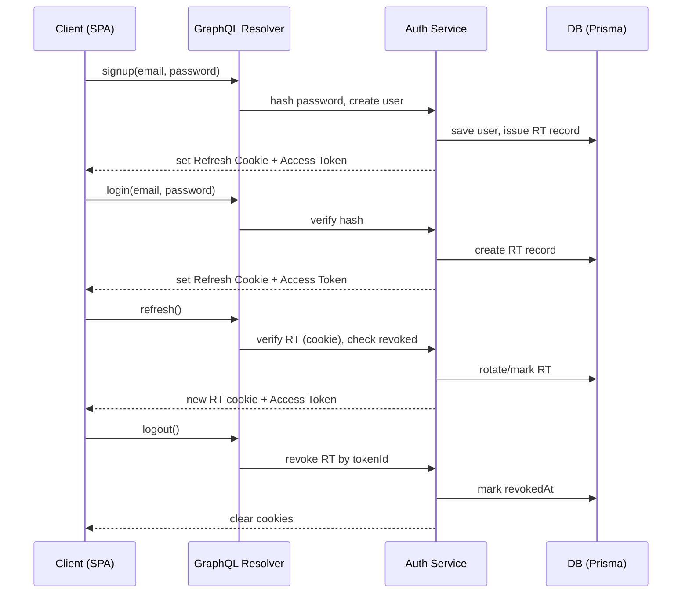
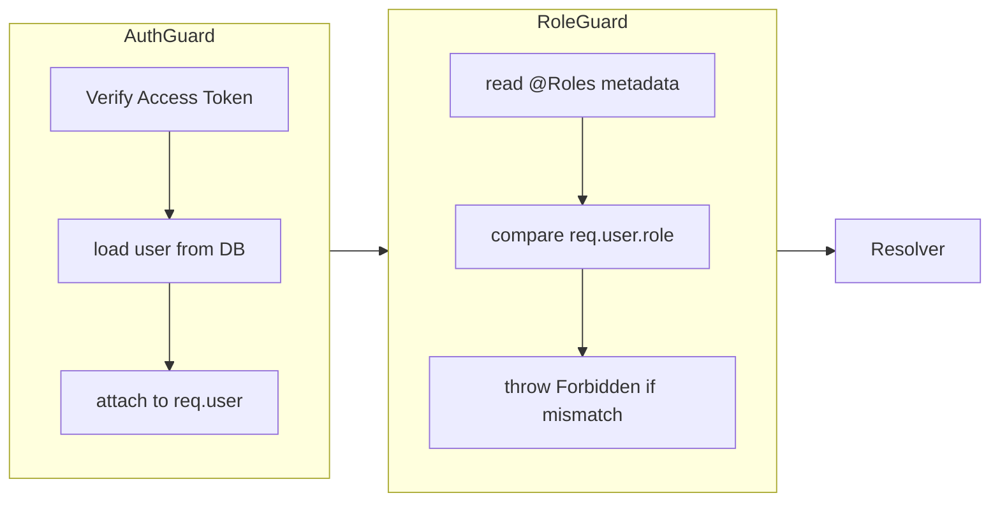

# 認証・認可設計（NestJS + GraphQL）

BtoB SaaS の BFF として NestJS + GraphQL(Code First) を採用した際の認証・認可の実装指針。初期は個人開発・低コストを前提としつつ、将来の拡張余地を明確にする。

## 決定事項（必ず守る）
- **認証方式**: Email + Password、自前実装。パスワードは `bcrypt` の 12 以上の cost でハッシュ化し、平文・復号は保持しない。
- **トークン構成**: JWT の Access Token（短命、5〜15分想定）と Refresh Token（長命、30〜90日想定）を発行する。署名鍵は `.env` で管理し、アルゴリズムは `RS256` を優先（最小限で HS256 も許容、鍵管理のしやすさを重視）。
- **JWT claims 設計**: `sub`(userId), `email`, `role`, `iat`, `exp` を必須。多テナントを想定しないため `tenant` は含めない。不要な個人情報は格納しない。
- **保管場所**: Access Token はブラウザメモリ、Refresh Token は HttpOnly + Secure + SameSite=Lax Cookie。API は CORS 制約を最小化するため 1st party ドメインで運用する。
- **失効戦略**: Refresh Token は DB にハッシュで保存し、`tokenId` を持たせる。ログアウト/再発行時にトークンレコードを無効化（`revokedAt` 設定）し、同一 `tokenId` の再利用を拒否。Access Token は短命＋サーバ側ブラックリストは持たない。
- **Role ベース認可**: ユーザーは最小限 `USER` `ADMIN` を持つ列挙。Resolver Guard（`@UseGuards(RoleGuard)`）とカスタム Decorator（`@Roles('ADMIN')`）で判定し、GraphQL スキーマ単位で責務境界を明示。
- **Context 取り出し**: `GqlExecutionContext` から `req` を取り出し、Guard で `req.user` を利用。AuthGuard で JWT を検証した上で user を `context` にセットする。Resolver 内では `@CurrentUser()` Decorator を使い型安全に取得する。
- **非同期レスポンス**: 失敗時のメッセージは曖昧さ優先（「認証に失敗しました」等）。タイミング攻撃を避けるため、存在しないメールでも同一の応答時間を心がける。

## 未決定事項（要検討）
- Refresh Token の有効期限確定（30/60/90 日など）。
- パスワードポリシー（長さ、記号必須、ブルートフォース防止のロック閾値）。
- 端末・ブラウザごとのセッション管理可否（デバイス名を `tokenId` と紐付けるか）。
- IP / UA バインドを行うか（プライバシーと利便性のトレードオフ）。

## 将来拡張余地
- Permission ベースへの拡張: Role は列挙のままにし、Resolver ごとに `@Permissions()` Decorator を追加できる余地を残す。Role → Permission のマッピングは DB/Config で管理可能な設計とする。
- トークンローテーション: Refresh Token をワンタイム化し、毎回更新する「ローテーション + Reuse Detection」を導入できるよう `tokenId` と `parentTokenId` を持つカラムを確保。
- 多要素認証: Email OTP や TOTP を追加するため、`User` に `mfaEnabled` を追加しても GraphQL Schema に後方互換で載せられるようにする。
- 非同期イベント: ログイン成功/失敗をドメインイベントとして発火し、将来的な監査ログ・通知基盤（キュー）に接続可能な構造にする。

## フロー（Signup / Login / Refresh / Logout）

## JWT claims 詳細
| Claim | 必須 | 内容 | 備考 |
| --- | --- | --- | --- |
| `sub` | ✅ | User ID | DB の UUID/文字列をそのまま使用 |
| `email` | ✅ | ログインメール | 変更時は再発行必須 |
| `role` | ✅ | `USER` / `ADMIN` | Permission 拡張時のマッピングキー |
| `iat` / `exp` | ✅ | 発行/失効時刻 | UNIX time（秒） |
| `tokenId` | Refresh | RT レコード識別子 | DB でハッシュ保存、再発行/無効化に利用 |

## Access / Refresh Token の管理
- **保存**: Access Token は JS メモリに保持し、GraphQL リクエスト時に `Authorization: Bearer <token>` で送信。Refresh Token は HttpOnly Cookie で自動送信させる。
- **CSRF 対策**: Cookie を使うため、GraphQL でも `SameSite=Lax` とし、状態変更 Mutation では `X-CSRF-Token` ヘッダーとダブルサブミットパターンを採用可能なようにフィールドを予約。
- **失効**: Refresh Token 失効時は対応する Access Token を即時無効化しない代わりに、短い TTL とローテーションでリスクを低減。漏洩検知時のみ一時的にブラックリストを導入する余地を残す。

## Guard / Decorator 実装方針

- `AuthGuard`: `@UseGuards(GqlAuthGuard)` を Resolver/Mutation に付与。`GqlExecutionContext` で `req` を取得し、Authorization ヘッダーの Bearer Token を検証。失敗時は `UnauthorizedException`。
- `RoleGuard`: メタデータを `@Roles('ADMIN')` で付与し、`req.user.role` と比較。`PUBLIC` な Query には付与しない。
- `@CurrentUser()` Decorator: `ExecutionContext` から `context.req.user` を取り出すユーティリティ。Resolver 引数で型を明示し、Nullable を避ける。

## GraphQL Context 利用
- `GraphQLModule` で `context: ({ req, res }) => ({ req, res })` を設定し、Guard/Resolver で共有。
- DataLoader など後続層でも `context.user` を参照できるよう型定義を `@types/graphql-context.d.ts` などにまとめる。
- テストでは `context` にダミー `user` を差し込めるヘルパーを用意し、Guard の単体テストと Resolver の統合テストを分離する。

## セキュリティ上の注意点
- パスワードリセット/メール検証の URL は署名付き一時トークン（JWT とは別）を使用し、同一鍵を再利用しない。
- Refresh Token のハッシュには Access Token と異なる秘密鍵/pepper を用い、データベース流出時の再利用を防ぐ。
- ログにはトークンを出力しない。失敗理由を詳細に返さず、レートリミットや CAPTCHA を導入可能な構造にする。
- HTTPS 前提で運用し、Cookie には `Secure` を必須とする。本番環境のみ Cookie ドメインを設定する。

