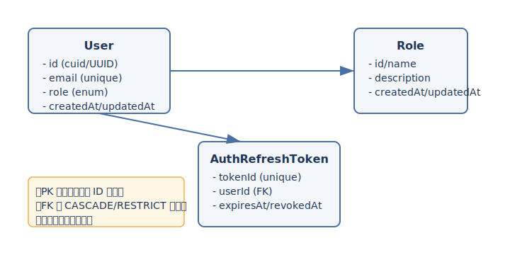

# データモデル設計（Prisma 前提）

NestJS + GraphQL(Code First) を BtoB SaaS の BFF として利用する際のデータモデル設計ガイド。初期は SQLite、将来は PostgreSQL への移行を想定し、実装に直結する判断・規約・禁止事項を明示する。



## 決定事項（必ず守る）

### テーブル設計指針
- 主キーはアプリケーション側で生成する文字列 ID（`cuid()` もしくは UUIDv4）を使用し、DB 依存のオートインクリメントを避ける。
- 外部キーは必ず設定し、`ON UPDATE CASCADE` / `ON DELETE RESTRICT` を基本とする。論理削除を採用するテーブルのみ `SET NULL` を選択肢として検討する。
- 参照整合性を重視し、中間テーブル（例: `UserRole`）も FK を必須とする。GraphQL のスキーマに表れない技術テーブル（トークン管理等）でも同様。
- 列挙値は Prisma の `enum` で固定し、Role は `USER` / `ADMIN` の 2 種類を初期セットとする。
- 非同期処理は未導入のため、ジョブキュー用テーブルは作らない。後付けに備え、既存テーブルでキュー依存のカラムを予約しない。

### 監査カラム
- すべてのエンティティに `createdAt`（`@default(now())`）と `updatedAt`（`@updatedAt`）を必須付与する。タイムゾーンは UTC 固定。
- 監査カラムはアプリ層から直接書き換えない。Service 層での `update` 時はビジネスカラムのみ指定し、Prisma による自動更新に任せる。

### 論理削除の方針
- 初期は論理削除を採用しない（行削除）。外部キー制約とユニーク制約をシンプルに保つため。
- 例外的に履歴保持が不可欠なテーブル（例: Refresh Token トレース）では `revokedAt` や `expiresAt` で状態管理し、`deletedAt` は導入しない。
- 論理削除が必要と判断する基準: 「履歴保持が必須」「復元要件が明確に存在」「ユニーク制約緩和が必要」のいずれかを満たす場合のみ。採用時は `deletedAt` を追加し、クエリは必ず `WHERE deletedAt IS NULL` を強制する Repository を挟む。

### インデックス設計
- 検索キー（メールアドレス、外部キー、組み合わせ検索）は `@@unique` / `@@index` で明示的に定義する。SQLite と PostgreSQL の両方で意味があるものに限定し、部分インデックスや関数インデックスは避ける。
- 複合ユニークを持つ中間テーブルは `@@id([fk1, fk2])` または `@@unique([fk1, fk2])` を使い、重複登録を防ぐ。
- 頻出ソート列（例: `createdAt`）は単一インデックスを付与し、ページング性能を確保する。

### Prisma schema 設計時の注意点
- SQLite/ PostgreSQL 両対応の型を選択する。数値は `Int`/`BigInt`、文字列は `String`、日時は `DateTime` を基本とし、DB 固有の `@db.*` 指定は避ける。
- JSON が必要な場合は `Json` 型を使うが、最小限に留める。PostgreSQL で JSONB に移行する際は `@db.JsonB` を別ブランチで検討する。
- リレーションは `@relation` で明示し、双方のフィールド名に役割がわかる名前を付ける（例: `user`, `tokens`）。
- Prisma Client のクエリは Repository 層に集約し、Resolver/Service から生 SQL を呼ばない。
- スキーマ変更は `prisma/schema.prisma` のみで行い、`node_modules/.prisma` など生成物は触らない。

### マイグレーション運用
- 開発環境（SQLite）では `npx prisma migrate dev --name <change>` を利用し、コミットにマイグレーションを含める。生成された SQL をレビューする。
- 本番（PostgreSQL）では `npx prisma migrate deploy` を使用し、マイグレーションの順序保証のため CI/CD で自動適用する。
- 破壊的変更（カラム削除/型変更）は「追加 → データ移行 → 旧カラム削除」の 2 段階に分け、後方互換期間を設ける。
- Seeder は Prisma の `seed` 機能で最小限の初期データ（管理者ユーザー、ロール）に限定する。テストデータはテストコード側で作成する。

## 未決定事項（要検討）
- Primary Key の実装方式を `cuid2` に統一するか、UUIDv4 も許容するか。
- トランザクション境界の標準化（Resolver 単位/Service 単位のどちらでまとめるか）。
- 将来の PostgreSQL 移行時に `citext` を使ってメールアドレス比較をケースインセンシティブにするか。

## 将来拡張余地
- 監査ログ用テーブル（操作履歴、GraphQL リクエストログ）の追加。現時点ではアプリログで代替し、Prisma 拡張で後付け可能。
- 行レベルセキュリティの導入: 単一テナント前提だが、将来の権限制御強化に備え、`role` 列挙を Permission マッピングへ拡張できるようにする。
- キュー導入時のアウトボックス/インボックステーブル追加。既存テーブルへのカラム追加は行わず、独立テーブルで疎結合に保つ。

## ER 図（Mermaid）
```mermaid
erDiagram
    USER ||--o{ AUTH_REFRESH_TOKEN : issues
    USER ||--o{ USER_ROLE : has
    ROLE ||--o{ USER_ROLE : grants

    USER {
        string id PK
        string email
        string passwordHash
        string role (enum: USER/ADMIN)
        datetime createdAt
        datetime updatedAt
    }

    AUTH_REFRESH_TOKEN {
        string id PK
        string userId FK
        string tokenId
        datetime expiresAt
        datetime revokedAt
        datetime createdAt
        datetime updatedAt
    }

    ROLE {
        string id PK
        string name
        string description
        datetime createdAt
        datetime updatedAt
    }

    USER_ROLE {
        string userId FK
        string roleId FK
        datetime createdAt
    }
```

## サンプル Prisma モデル抜粋
```prisma
model User {
  id            String   @id @default(cuid())
  email         String   @unique
  passwordHash  String
  role          Role     @default(USER)
  tokens        AuthRefreshToken[]
  createdAt     DateTime @default(now())
  updatedAt     DateTime @updatedAt
}

model AuthRefreshToken {
  id         String   @id @default(cuid())
  tokenId    String   @unique
  user       User     @relation(fields: [userId], references: [id], onDelete: Restrict)
  userId     String
  expiresAt  DateTime
  revokedAt  DateTime?
  createdAt  DateTime @default(now())
  updatedAt  DateTime @updatedAt
}

enum Role {
  USER
  ADMIN
}
```
