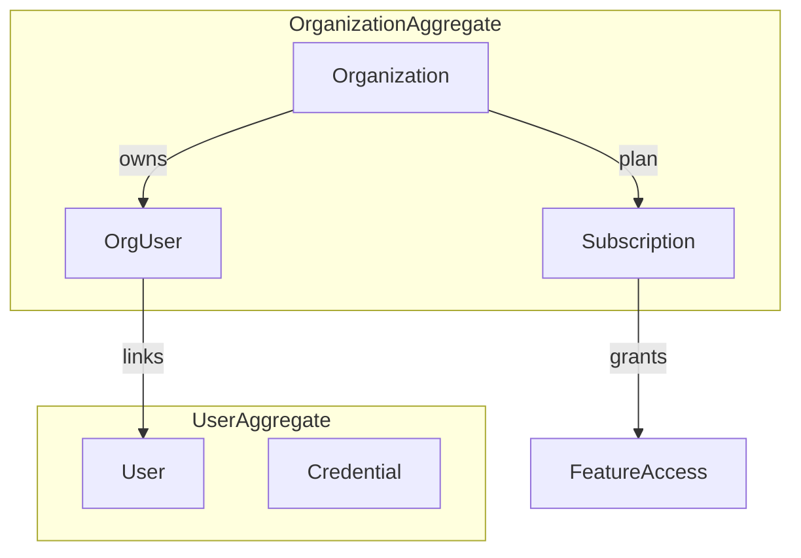
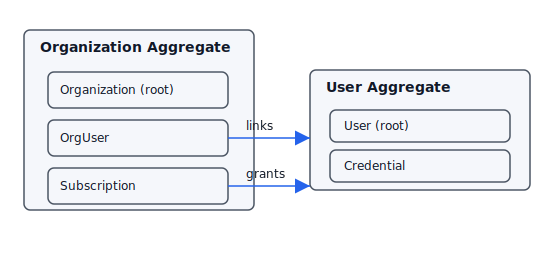

# ドメインモデル設計テンプレート（BtoB SaaS / NestJS + GraphQL）

本テンプレートは NestJS + GraphQL(Code First) で構築する BtoB SaaS の初期設計における実装直結の判断基準をまとめる。クライアントは Web SPA のみを想定し、初期は個人開発・低コストを最優先する。

## 方針サマリ
- **GraphQL は BFF**: スキーマはクライアント境界の契約。Resolver からドメイン層への依存を一方向に保つ。
- **JWT 認証/認可**: Email+Password でアクセストークン/リフレッシュトークンを発行。Resolver Guard で Role ベースの認可を強制する。
- **DB 抽象化**: Prisma を ORM として利用し、SQLite から PostgreSQL への移行を阻害する SQL 直書き・DB 依存実装を禁止。
- **単一テナント**: マルチテナント考慮不要だが、将来的な識別子拡張に備えて `tenantId` を導入しない設計も明示的に選択する。

## 決定事項
- ドメインモデルは **集約単位で永続化**し、Prisma の schema も集約境界を反映する。
- **ユビキタス言語**をスキーマ、Resolver 名、DTO/Entity 名に反映し、英語優先・日本語対訳はドキュメント化に留める。
- **不変条件はコンストラクタまたはファクトリで検証**し、集約外からの状態変更を禁止するメソッドを用意する。
- **Domain Event は初期導入しない**。非同期要件が生じたらイベントを追加し、Pub/Sub 実装を境界適用する。
- 認証はメールアドレスをユニークキーとし、パスワードハッシュはドメイン外（Auth サービス）で扱う。

## 未決定事項
- Role の粒度（例: `OWNER`/`ADMIN`/`MEMBER` の階層や権限マトリクス）。
- 監査ログの保存期間とフォーマット。
- 請求・課金ドメインの導入タイミング（初期は固定プラン想定）。

## 将来拡張余地
- **Domain Event 導入**: Prisma Transaction Hook またはメッセージング層追加でイベント発行する設計に変更可能。
- **マルチテナント化**: `tenantId` 列の追加とインデックス設計でスキーマ拡張可能。
- **非同期処理**: バッチ／キュー導入時、ドメインサービスの副作用をイベントに切り出す余地を残す。

## ユビキタス言語の運用
- ビジネス用語を **GraphQL 型名・Resolver 名・ドメインクラス名で統一**する。
- ユーザーや顧客との合意語彙を Notion/Doc に列挙し、変更時はスキーマの破壊的変更を伴うかを必ず検討する。
- テーブル名・フィールド名も合意語彙を使用し、略語を避ける（`subscription`, `workspace`, `featureFlag` など）。

## Entity / Value Object / Aggregate 指針
- **Entity**: 永続的 ID を持ち、ライフサイクル管理が必要なもの（例: `Organization`, `User`, `Subscription`）。ID は UUID。集約ルートのみ外部から参照。
- **Value Object**: 不変かつ等価性で比較される概念（例: `Email`, `PlanPeriod`, `DisplayName`）。作成時にバリデーションを完了し、再利用可能にする。
- **Aggregate**: トランザクション境界。外部は集約ルートを通じてのみ変更する。Prisma の Relation を利用する場合も **外部から子エンティティへの直接操作を禁止**。
- **識別子ルール**: 集約間参照は ID のみ。外部キーを GraphQL で露出する際は DataLoader 等で N+1 回避。

## 不変条件（Invariant）の扱い
- 不変条件は **コンストラクタ/Factory と状態変更メソッドで即時検証**する（例: `Subscription` は開始日 <= 終了日）。
- Prisma への永続化前に必ずドメインモデル経由で検証し、`@prisma/client` の型だけに依存しない。
- Guard では認可チェックのみを行い、ビジネスルールはドメイン層で失敗させる。

## Domain Service / Factory の使い分け
- **Factory**: 複数の Value Object を組み合わせて初期状態を作る責務。外部入力の正規化・ID 生成を担当。
- **Domain Service**: 複数集約に跨るビジネスロジックや、ポリシー決定を担う。永続化は Application 層に委ね、トランザクション境界は Service で開始しない。
- **禁止事項**: Domain Service からインフラ直接呼び出しを行わない。外部 API コールは Application 層に委譲。

## Domain Event を初期導入しない理由と将来方針
- 初期は同期処理のみで十分であり、イベントキューやリトライの運用コストを削減する。
- 将来、通知・監査・外部連携が必要になったら、**集約ルートがイベントを発行し Application 層がハンドリング**する方針を採用する。
- Prisma Transaction の `afterCommit` フックやメッセージング実装を差し替え可能なインターフェース経由で追加する。

## 汎用的なサンプル（業務未確定時のテンプレート）
以下は最小構成の集約例。実装時は各集約ごとに Factory と Invariant を用意する。

### サンプルルール（例示）
- **Organization**: `name` は必須。削除時は関連 `OrgUser` を論理削除。
- **User**: `email` はユニーク。`Credential` はパスワードハッシュとソルトを保持。
- **Subscription**: `status` は `ACTIVE|TRIAL|CANCELLED`。`trialEndsAt` は開始日より後であること。
- **FeatureAccess (Value Object)**: `featureKey` と `limit` の組で等価性を判定。

## 画像イメージ

## 運用チェックリスト
- [ ] GraphQL 型名・Resolver 名がユビキタス言語と一致している
- [ ] 集約外から子エンティティを更新するコードが存在しない
- [ ] Factory/Domain Service で不変条件を検証している
- [ ] Prisma スキーマに DB 固有の型や SQL 直書きが混ざっていない
- [ ] Domain Event を前提とした実装が混在していない
