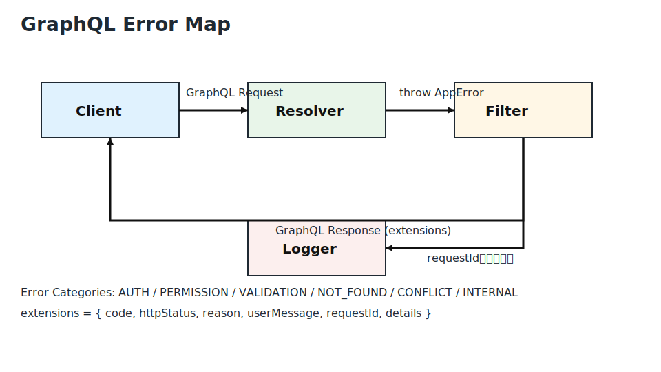

# GraphQL エラー設計（NestJS + GraphQL Code First）

BtoB SaaS BFF（Web SPA クライアントのみ）向けの GraphQL エラー設計。初期は個人開発・低コストを前提にしつつ、将来の拡張余地を残す。



## 決定事項（必ず守る）
- **エラー分類**: `Auth`(認証), `Permission`(権限), `Validation`(入力), `NotFound`, `Conflict`, `Internal` の 6 系統のみを採用し、Resolver/Service で統一する。
- **GraphQL `extensions` 標準構造**: 以下のキーを必須とし、それ以外を増やさない。
  - `code`: 上記分類を `UPPER_SNAKE_CASE`（例: `AUTH`, `VALIDATION`）。
  - `httpStatus`: マッピング済み HTTP ステータスコード（例: `401`）。
  - `reason`: 開発者向け短文（機密情報なし、英語推奨）。
  - `userMessage`: UI 表示用の汎用メッセージ（日本語可、詳細を含めない）。
  - `requestId`: `Correlation-Id` ヘッダーを優先。なければ `uuid` を Filter で生成して付与。
  - `details`: バリデーション項目などユーザーに返してよい追加情報のみを配列/オブジェクトで格納。
- **HTTP ステータスとの対応**: GraphQL では 200 だが、`extensions.httpStatus` に以下を格納し、APM/ログではこの値を参照。
  | 種別 | ステータス | 説明 |
  | --- | --- | --- |
  | Auth | 401 | 署名不正・期限切れ・Cookie 不在 |
  | Permission | 403 | Role/Guard ミスマッチ |
  | Validation | 400 | DTO/パラメータのスキーマ違反 |
  | NotFound | 404 | ID 存在なし、ソフトデリート済み |
  | Conflict | 409 | 一意制約、状態遷移の競合 |
  | Internal | 500 | 想定外の例外、外部依存失敗 |
- **NestJS 例外/Filter 設計**: `AppError` ベースクラスを `Error` から派生させ、`code`/`httpStatus`/`reason`/`userMessage`/`details` を保持。Resolver では `throw new AuthError(...)` 等を使用。
  - `@Catch(AppError)` の `GqlExceptionFilter` を作成し、`GraphQLError` にラップして `extensions` を構築する。
  - `HttpException` 系（`UnauthorizedException` など）は Filter 内で `AppError` に変換するアダプタを持たせる。
  - 予期しない例外は `InternalError` にフォールバックし、スタックトレースはログのみへ出力。
- **ログ出力規約**: `requestId` を必須。`email`/`token`/個人識別子はログに残さない。`details` に PII が含まれる場合はサニタイズしてから格納する。レート制限の判定材料になる情報は INFO 以上に出さない。
- **クライアント指針**: `extensions.code` と `userMessage` を最優先に扱い、`reason` は開発者向けとしてコンソール出力のみ。`Validation` の `details` には `field`/`message` を配列で返し、Form バインドを容易にする。
- **Guard/Resolver 実装方針**: Guard 内の `throw new AuthError('TOKEN_EXPIRED', ...)` など、分類を直接投げる。Resolver 層ではドメイン知識に基づき `NotFound`/`Conflict` を必ず使い分け、`Internal` を安易に投げない。

### `extensions` サンプル
```json
{
  "message": "認証に失敗しました",
  "extensions": {
    "code": "AUTH",
    "httpStatus": 401,
    "reason": "TOKEN_EXPIRED",
    "userMessage": "再度ログインしてください",
    "requestId": "6d83d7d8-4c11-4a30-8c26-53d2163165a4",
    "details": null
  }
}
```

### エラー伝播フロー
```mermaid
flowchart LR
    C[Client (SPA)] -->|GraphQL Mutation/Query| R[Resolver]
    R -->|throws AppError| F[AppError filter]
    F -->|maps to GraphQLError\nextensions| G[GraphQL Response]
    F -->|logs with requestId| L[Logger]
    G --> C
```

## 未決定事項（要検討）
- `userMessage` の多言語対応（i18n ライブラリ採用可否、翻訳キー運用）。
- `details` に stack trace を部分的に含めるか（開発環境限定かどうか）。
- バリデーションのエラー整形を class-validator の `validationError.target` 削除のみで足りるか、独自パーサーを入れるか。

## 将来拡張余地
- **監査・APM 連携**: Sentry/Datadog などに `requestId` と `extensions` をそのまま送信する Hook を Filter に差し込めるようにする。
- **再試行ヒント**: `Conflict` などリトライ可能なものには `extensions.retryAfter` を追加可能な設計にしておく（現状は未使用）。
- **非同期処理導入時の整合性**: 将来キューを導入しても、Resolver の Sync/Async 双方で同じ `AppError` を投げられるようエラーモジュールをインフラ層から独立させる。
