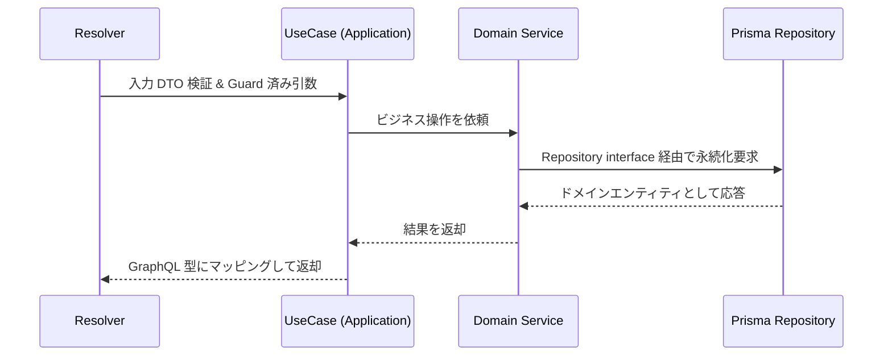
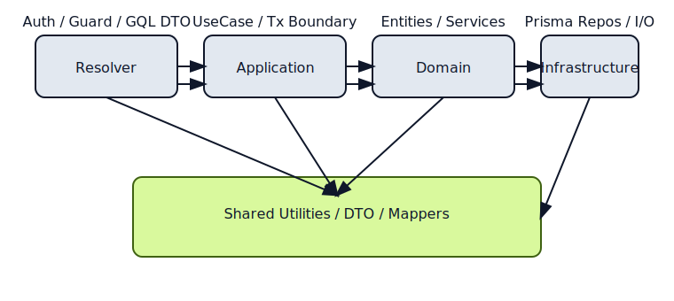

# NestJS + GraphQL(Code First) レイヤードアーキテクチャ設計

## 共通定義
- 対象: NestJS + GraphQL(Code First) BtoB SaaS（BFF 経由、クライアントは Web SPA のみ）。
- 認証: Email/Password + JWT（Access/Refresh）。
- 認可: Role ベース、Resolver Guard で実装。
- ORM: Prisma。DB は初期 SQLite、将来 PostgreSQL 移行を前提に DB 依存・生 SQL を禁止。
- マルチテナント: 非対応（単一テナント）。
- 非同期処理: 当初なしだが後付け可能な余地を確保。
- 初期は個人開発かつ低コストを最優先。

### 決定事項
- GraphQL を BFF とし、クライアントは Web SPA のみを対象とする。
- 認証は自前実装の Email/Password + JWT（Access/Refresh）で、トークン検証は Guard で実施。
- レイヤーは Resolver / Application / Domain / Infrastructure / Shared の 5 分割とし、依存方向は上位→下位のみ許可。
- Prisma Repository は Infrastructure 層に置き、Domain が定義する Repository interface を実装する。
- トランザクションは Application 層の UseCase で開始・終了し、Domain はトランザクション境界を意識しない。
- DB 可搬性を担保するため、Prisma Client 以外の DB 依存実装や生 SQL を禁止。

### 未決定事項
- ログ集約方式（例: OpenTelemetry/Datadog など）は未定。
- メトリクス/トレーシングの粒度と導入タイミング。
- レートリミットや CAPTCHA の導入方針。

### 将来拡張余地
- 非同期ジョブ基盤（例: BullMQ）を追加可能なようにドメインイベント発行ポイントを明示しておく。
- PostgreSQL 移行時にシームレス切替できるよう Prisma Schema の DB 固有機能は避ける。
- サードパーティ IdP 統合（SAML/OIDC）を追加できるよう、認証ストラテジは差し替え可能なインターフェースにする。

## レイヤー定義と責務
```mermaid
graph TD
  A[Resolver 層] --> B[Application 層 (UseCase)]
  B --> C[Domain 層]
  C --> D[Infrastructure 層]
  A -.-> E[Shared 層]
  B -.-> E
  C -.-> E
  D -.-> E
```

- **Resolver 層**: GraphQL スキーマ/DTO/入力検証、認証・認可 Guard を付与。ビジネスロジックや DB 参照は禁止。
- **Application 層 (UseCase)**: ユースケース単位のオーケストレーション。トランザクション開始/終了を担当し、Domain サービス・Repository を呼び出す。プレゼンテーション関心（GraphQL 特有の都合）を混在させない。
- **Domain 層**: エンティティ、値オブジェクト、ドメインサービス、Repository interface を定義。I/O を直接扱わない。外部ライブラリへの直接依存は禁止。
- **Infrastructure 層**: Prisma Repository 実装、メール送信など外部 I/O 実装。ドメインオブジェクトへのマッピング以外のビジネスロジックは禁止。
- **Shared 層**: 共通ユーティリティ、例外ハンドリング、型、DTO 変換器などレイヤーを跨いで再利用される純粋関数や抽象のみ。ドメイン知識を持たない。

### 依存関係の方向（許可・禁止）
- 許可: Resolver → Application → Domain → Infrastructure。各層は Shared を参照可。
- 禁止: 下位層から上位層への依存（例: Infrastructure が Application/Resolver を参照）、横断的依存（Application 同士の密結合）を禁止。
- Prisma Client の直接利用は Infrastructure の Repository 実装に限定し、Application/Resolver/Domain からの直接呼び出しは禁止。

## トランザクション境界
- Application 層の UseCase 単位で `PrismaService` などを用いてトランザクションを開始し、ユースケース終了時にコミット/ロールバックする。
- Domain 層はトランザクション存在を意識せず、純粋なドメインロジックを保つ。
- 同一ユースケースで複数 Repository を扱う場合も、Application 層のトランザクションスコープにまとめる。

## フロー（Resolver → UseCase → Domain → Repository）


## NestJS Module / ディレクトリ構成例
```
src/
  modules/
    user/
      user.module.ts
      user.resolver.ts          # Resolver 層
      application/
        use-cases/
          create-user.use-case.ts
      domain/
        entities/user.entity.ts
        value-objects/email.vo.ts
        services/user.domain-service.ts
        repositories/user.repository.ts   # interface
      infrastructure/
        repositories/prisma-user.repository.ts
      shared/
        mappers/user.mapper.ts
        dto/user.input.ts
  common/
    guards/
    exceptions/
    filters/
```
- Prisma Repository は `modules/<context>/infrastructure/repositories/` に置き、Domain で定義した interface を実装する。
- GraphQL の型/DTO は Resolver 配下または Shared にまとめ、Domain へ持ち込まない。

## よくあるアンチパターンと回避策
- **Resolver でビジネスロジックや Prisma Client を直接呼ぶ**: Application/Domain を経由し、テスト容易性と責務分離を守る。
- **Domain が外部 I/O を知る**: Repository interface 以外の外部依存を禁止し、テストダブルで置き換え可能にする。
- **Application 層が GraphQL の都合（Pagination 型など）を知りすぎる**: GraphQL 特有の型変換は Resolver/Mapper に閉じ込める。
- **トランザクションを Repository 単位で個別に開始する**: UseCase 単位でまとめて開始し、一貫性を確保する。
- **Shared にドメイン知識を混入させる**: Shared は純粋ユーティリティに限定し、ドメインルールは Domain に置く。

## ビジュアル（簡易レイヤー図）

