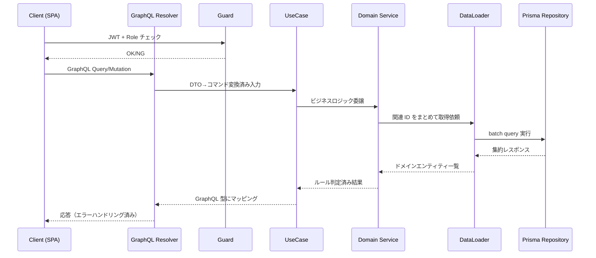
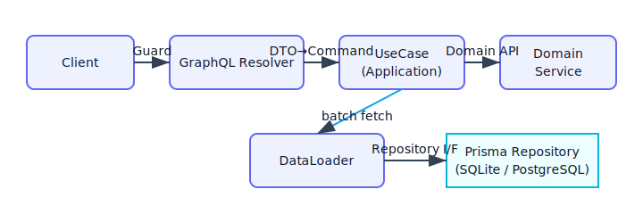

# NestJS GraphQL Resolver 設計ガイド

## 共通定義
- 対象: NestJS + GraphQL(Code First) BtoB SaaS。GraphQL は BFF、クライアントは Web SPA のみ。
- 認証: 自前実装 Email/Password + JWT（Access/Refresh）。
- 認可: Role ベースで Resolver の Guard で制御。
- ORM: Prisma。DB は初期 SQLite、将来 PostgreSQL 移行を前提に DB 依存実装・生 SQL を禁止。
- マルチテナント: 非対応（単一テナント）。
- 非同期処理: 初期は導入せず、後付け可能な余地を残す。
- 初期は個人開発・低コスト優先。

## 決定事項
- Resolver は入力 DTO/GraphQL 型の定義・Guard 適用・UseCase 呼び出しのみを責務とし、ビジネスロジックや Prisma 直接呼び出しは禁止。
- UseCase への委譲は「Resolver で入出力を GraphQL 型にマッピングし、ビジネスルールは必ず UseCase/Domain に移譲する」ことを徹底する。
- 認可 Guard は操作の粒度で付与し、同一 Resolver 内でも操作ごとに最小権限となる Guard を設定する。
- 業務エラーはドメイン例外（アプリケーション例外）として `HttpException` 系にマッピングして投げ、認可失敗は `ForbiddenException`/`UnauthorizedException`、バリデーションは `BadRequestException` に統一する。
- N+1 回避のため DataLoader を各モジュール単位で用意し、Field Resolver からの関連取得は DataLoader 経由に限定する。
- Field Resolver は「関連の遅延ロード」「GraphQL 特有のフィールド整形」に限定し、単純パススルーや同一クエリで取得済みの値の再取得は避ける。
- Resolver での共通処理はデコレーター/Guard/Interceptor で再利用し、ロジックのコピペを禁止する。

## 未決定事項
- Guard で利用するロール定義の標準セット（例: `ADMIN`/`OPERATOR`/`READONLY`）と命名規約。
- GraphQL エラー拡張項目（`extensions.code` など）の具体的なマッピング方針。
- DataLoader のキャッシュ時間や無効化ポリシー。

## 将来拡張余地
- マルチリージョン展開時に Guard でリージョン制約を差し込めるよう、Guard をコンポーズ可能に設計する。
- サードパーティ IdP 連携（SAML/OIDC）追加時に既存 Guard の JWT 検証ロジックを差し替え可能にする。
- クエリキャッシュや persisted query を導入して Resolver 負荷を下げる余地を残す。

## Resolver の責務と禁止事項
- **責務**: GraphQL 型定義、引数バリデーション（`class-validator`）、Guard/Interceptor の適用、UseCase へのデータ整形と結果マッピング。
- **禁止**: ビジネスルール実装、Prisma Client 直接呼び出し、ドメインイベント発行、トランザクション制御、ログ出力の細分化（共通 Interceptor に委譲）。

## UseCase への委譲ルール
- 引数は Resolver で GraphQL DTO→UseCase 用コマンドオブジェクトに変換してから渡す。
- UseCase から返るドメインモデルは Resolver で GraphQL 型へマッピングし、副作用を持つ処理は UseCase 内で完結させる。
- UseCase はドメインサービス・Repository を介してのみデータアクセスし、Resolver はそれに干渉しない。

## 認可 Guard の適用指針
- **型レベル**: ルート Query/Mutation ごとにロールベース Guard を必須化し、匿名許可は認証不要 API に限定。
- **フィールドレベル**: 部分的な権限差がある場合は Field Resolver 単位で Guard を追加する。
- **Token**: Access Token 検証を基本とし、Refresh Token を Resolver で直接扱わない（専用 UseCase で処理）。
- **例外処理**: Guard 内で例外を握りつぶさず、標準例外をそのまま伝播させる。

## エラーの投げ方
- **業務エラー**: UseCase/Domain で専用エラークラスを投げ、Resolver では `HttpException` 系に変換。ユーザー向けメッセージと `extensions.code` を分離。
- **認可エラー**: Guard で `UnauthorizedException`（未認証）/`ForbiddenException`（認可 NG）を返し、Resolver では追加変換しない。
- **バリデーションエラー**: DTO に `class-validator` を適用し、`BadRequestException` に統一。複数エラーはエラーパス付きで返す。

## N+1 問題への基本方針
- DataLoader を Request scope で提供し、関連取得は必ず batch 化する。
- Prisma の `include`/`select` でまとめ取得できるものは UseCase で先読みし、不要な Field Resolver を避ける。
- DataLoader はキー数を監視し、オブザーバビリティで N+1 検知を行う（メトリクス未決の場合はログにカウント）。

## Field Resolver を使うべき/避けるべきケース
- **使うべき**: 関連の遅延取得（例: `user.orders`）、表示専用の派生値（例: ラベル整形）、アクセストークン情報を元に絞り込むビュー。
- **避けるべき**: すでに親クエリで取得済みの値の再フェッチ、集計を安易に Field Resolver でループする実装、ビジネスロジックの再実装。

## パフォーマンス・可読性を損なうアンチパターン
- Resolver から Prisma Client を直接呼び出す（テスト困難・レイヤー違反）。
- Field Resolver 内でループしながら個別クエリを発行する（N+1）。
- Guard をスキップし Resolver 内でロール判定を行う（重複実装・漏れの温床）。
- UseCase を経由せずに Domain/Repository を直接呼ぶ（トランザクション境界が崩れる）。
- 例外を `console.log` のみで握りつぶす（可観測性低下）。

## フロー例（Mermaid）

## ビジュアル

