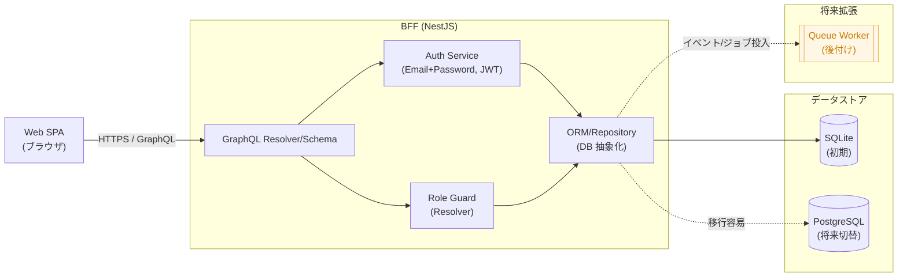

# システム構成図

Codex 用 BFF 構成の概要をまとめた図とポイントです。Web SPA が GraphQL API を介して NestJS 製 BFF に接続し、ORM 経由でデータベースへアクセスします。

## 前提・方針
- フレームワーク: NestJS（単一アプリ構成、API Gateway/マイクロサービスなし）
- API: GraphQL（@nestjs/graphql）
- クライアント: Web SPA
- 認証: Email+Password、自前実装の JWT ベース
- 認可: ロールベース、Resolver Guard で制御
- データベース: 初期は SQLite、将来的に PostgreSQL（ORM で抽象化）
- 非同期処理: 初期は未実装、後から Queue を追加可能な構造

## アーキテクチャ図

## 運用メモ
- 認証は JWT の発行・検証を BFF 内で完結させ、リフレッシュ運用は今後の要件に応じて追加します。
- ロールベース制御は Resolver Guard で一貫させ、GraphQL スキーマ側に権限境界を明示します。
- DB は ORM 経由のため、接続設定とスキーママイグレーションを切り替えるだけで SQLite から PostgreSQL へ移行可能です。
- キューは未導入ですが、イベントディスパッチや非同期ジョブを追加しても BFF の公開 API へ影響が及ばないよう疎結合に保ちます。
